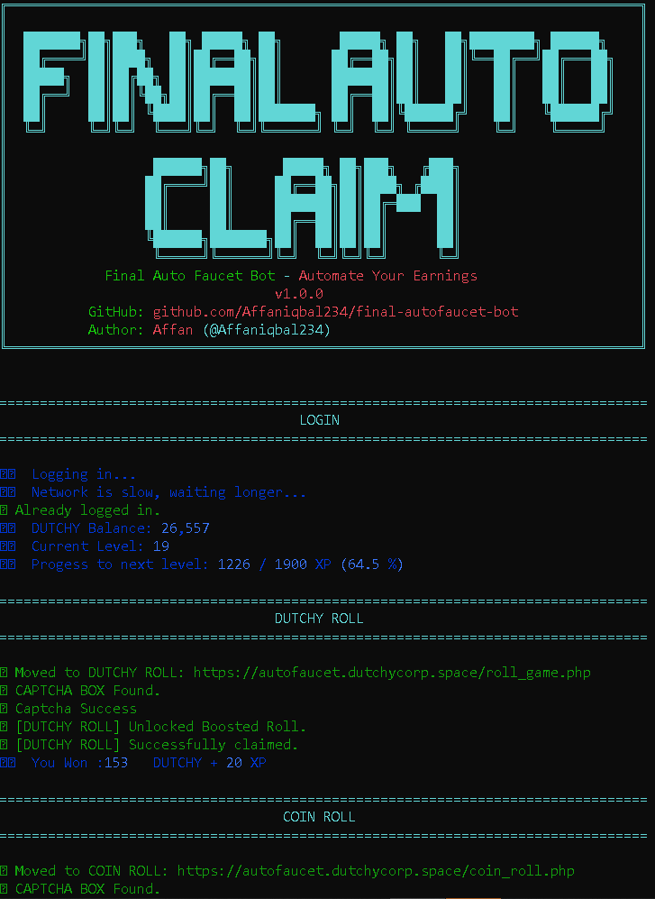
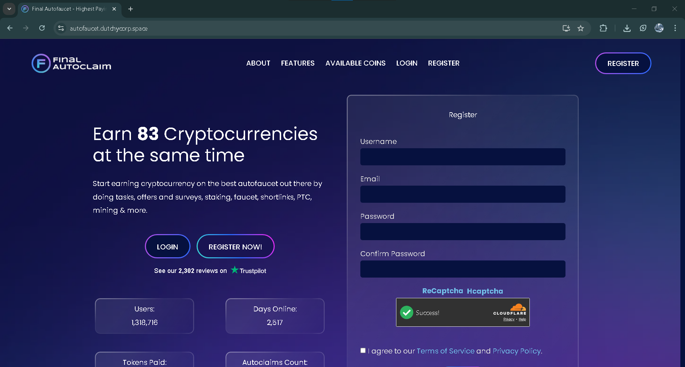
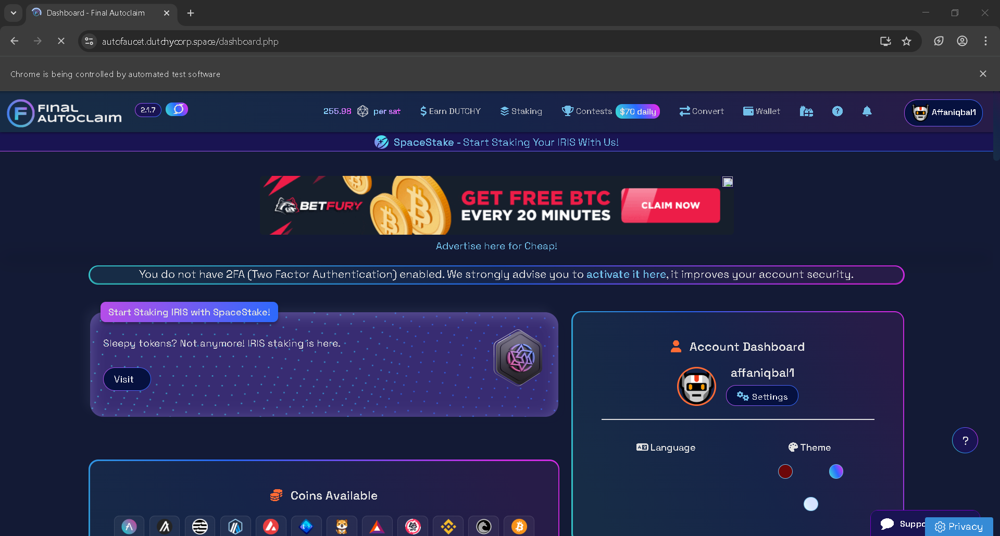

<p align="center">
    
    </p>

# Final Autofaucet BOT

Automated cryptocurrency claiming bot for autofaucet.dutchycorp.space with Cloudflare Turnstile captcha solving. The bot is built using Python and Patchright (Playwright).

<p align="center">
    <a href="https://www.python.org/">
        
    </a>
    <a>
        
    </a>
    <a href="https://www.google.com/chrome/">
        
    </a>
    <br/>
    <a href="hhttps://github.com/Affaniqbal234/final-autofaucet-bot/releases/tag/v1.0.0">
        
    </a>
    <a href="https://github.com/Affaniqbal234/final-autofaucet-bot">
        
    </a>
    <a href="https://github.com/Affaniqbal234/final-autofaucet-bot/blob/main/LICENSE">
        
    </a>
</p>

## Features

- Automated login with email/password
- Cloudflare Turnstile captcha solver
- Dutchy Roll faucet claiming
- Coin Roll faucet claiming
- PTC ads processing
- PTC Wall ads processing
- Persistent browser sessions (cookies saved)
- Optional headless mode (not recommended)

## Requirements

- Python 3.8 or higher
- Google Chrome browser installed
- Active account on [autofaucet.dutchycorp.space](https://autofaucet.dutchycorp.space)
- **Important:** Select Cloudflare Turnstile as the default captcha in your account settings first

## Installation

1. Clone the repository:
```bash
git clone https://github.com/Affaniqbal234/final-autofaucet-bot.git
cd final-autofaucet-bot
```

2. Install Python dependencies:
```bash
pip install -r requirements.txt
```

3. Install Chrome browser(required for automation):
```bash
patchright install chrome
```
(or via any other installation method)

4. Create configuration file:
```bash
copy .env.example .env
```
(On Linux/Mac use: `cp .env.example .env`)

5. Edit the `.env` file with your credentials:
```env
EMAIL=your_email@example.com
PASSWORD=your_password
HEADLESS=false
```

## Configuration

Edit the `.env` file with the following settings:

- `EMAIL` - Your autofaucet.dutchycorp.space account email (required)
- `PASSWORD` - Your account password (required)
- `HEADLESS` - Run browser in headless mode (default: false)

### Headless Mode Warning

⚠️ **IMPORTANT:** Setting `HEADLESS=true` may significantly increase the risk of account ban. Websites can detect headless browsers and may flag them as bots. It's strongly recommended to keep `HEADLESS=false` for safer operation.

## Usage

Run the bot:
```bash
python main.py
```
### Terminal Output


### AutoFaucetDutchyCorpSpace




## Troubleshooting

### "ERROR: EMAIL is missing in .env"
- Ensure you created a `.env` file (not `.env.example`)
- Verify that `EMAIL` and `PASSWORD` are filled in correctly

### "patchright: command not found" or browser installation issues
- Make sure you installed patchright: `pip install patchright`
- Then install the browser: `patchright install chrome` or `patchright install chromium`
- If issues persist, try: `python -m patchright install chromium` or `python -m patchright install chrome`

### "Login failed"
- Verify your credentials are correct
- Ensure you selected Cloudflare Turnstile as default captcha in account settings
- Check your internet connection

### Captcha not solving
- Make sure Cloudflare Turnstile is set as your default captcha type in account settings
- If issues persist, try running without headless mode

## License

MIT License - see [LICENSE](LICENSE) file for details.

## Contributing

Contributions are welcome! Feel free to:
- Report bugs by opening an issue
- Suggest new features
- Submit pull requests

## Support

If you found this project useful, please give it a ⭐ on GitHub!

For issues or questions, please open an issue on the [GitHub repository](https://github.com/Affaniqbal234/final-autofaucet-bot/issues).

## Disclaimer

This bot is provided for educational purposes. The author is not responsible for any misuse, violations of terms of service, or account bans. Use at your own risk and in accordance with the website's terms of service.

**Author:** [Affaniqbal234](https://github.com/Affaniqbal234)

