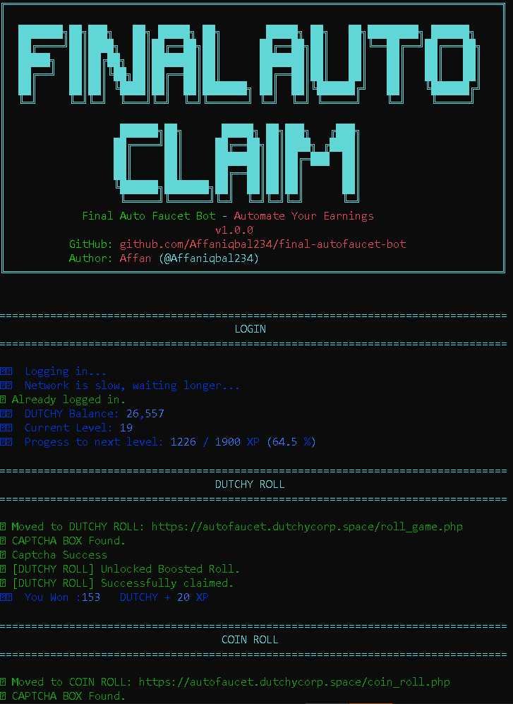
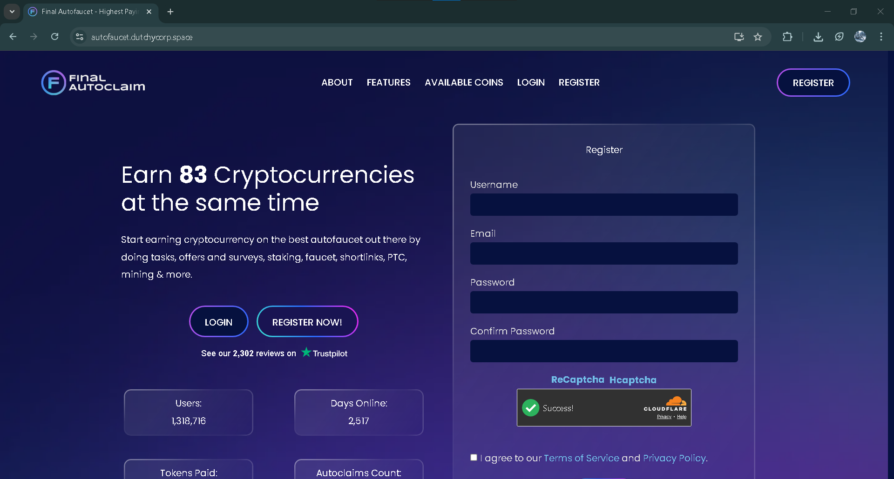
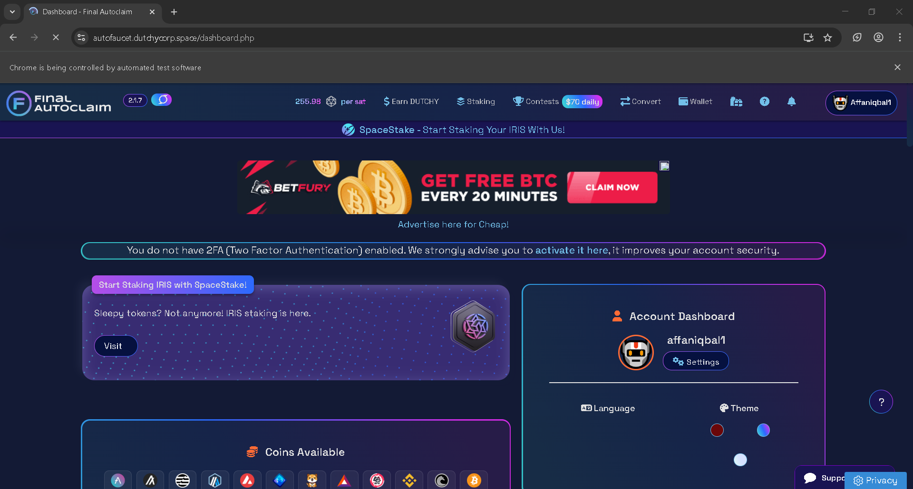

<p align="center">
  
</p>

<h1 align="center">Final Autofaucet Bot</h1>

<p align="center">
  Browser automation for Autofaucet Dutchy built with Python and Patchright, with persistent sessions, multi-step task execution, challenge handling, and stealth-focused operation under anti-bot constraints.
</p>

<p align="center">
  
  
  
  <a href="https://github.com/Affaniqbal234/final-autofaucet-bot/blob/main/LICENSE">
    
  </a>
</p>

## Overview

Final Autofaucet Bot automates repeated workflows on
[autofaucet.dutchycorp.space](https://autofaucet.dutchycorp.space).

The difficult part of the project was not simply automating clicks. The workflow involves authenticated sessions, timed transitions, repeated tasks, challenge pages, and anti-bot checks that make ordinary browser automation unreliable.

The original workflow was developed and debugged around those constraints. Standard Playwright automation was detected too easily during testing, so the project moved to Patchright and focused more heavily on browser behavior, session persistence, timing, recovery, and reducing obvious automation fingerprints.

## Features

- Automated account login
- Persistent authenticated browser sessions
- Cloudflare Turnstile challenge handling
- Dutchy Roll automation
- Coin Roll automation
- PTC ad processing
- PTC Wall processing
- Repeated task execution
- Timing-sensitive page interactions
- Recovery from failed or interrupted workflow steps
- Patchright-based browser automation with reduced automation fingerprints
- Configurable headed or headless execution

## Engineering Focus

### Detection resistance

The target site actively distinguishes automated browser behavior from normal browser sessions.

Patchright is used instead of standard Playwright to reduce common automation fingerprints and provide a better foundation for running the workflow under anti-bot constraints.

The project does not claim to be permanently undetectable. Detection systems change, so stealth is treated as an engineering constraint rather than a guarantee.

### Stateful workflows

The bot has to maintain state across authentication, faucet pages, PTC tasks, navigation, and repeated execution.

Browser state and cookies are persisted so each run does not have to start from a completely new session.

### Timing and page transitions

Many actions depend on the previous page reaching the expected state before the next interaction can happen.

The workflow therefore includes timing and state checks rather than treating the website as a sequence of immediate button clicks.

### Recovery

Browser automation can fail when pages load slowly, elements change, challenges appear, or navigation does not complete as expected.

The workflow includes recovery paths so a failed interaction does not always require restarting the complete process.

## Project Structure

```text
final-autofaucet-bot/
├── config/          # Configuration
├── core/            # Core browser and session logic
├── modules/         # Automated workflows
├── utils/           # Shared helpers
├── assets/          # README images
├── main.py          # Application entry point
├── requirements.txt
└── .env.example
```

## Requirements

- Python 3.8+
- Google Chrome
- An Autofaucet Dutchy account
- Cloudflare Turnstile selected as the account's default captcha type

## Installation

Clone the repository:

```bash
git clone https://github.com/Affaniqbal234/final-autofaucet-bot.git
cd final-autofaucet-bot
```

Install the dependencies:

```bash
pip install -r requirements.txt
```

Install the browser used by Patchright:

```bash
patchright install chrome
```

Create a local configuration file.

### Windows

```bash
copy .env.example .env
```

### Linux / macOS

```bash
cp .env.example .env
```

Add your account details:

```env
EMAIL=your_email@example.com
PASSWORD=your_password
HEADLESS=false
```

## Usage

Run:

```bash
python main.py
```

The bot starts the browser session and executes the configured workflow.

### Terminal



### Autofaucet Dutchy





## Configuration

| Variable | Description | Default |
| --- | --- | --- |
| `EMAIL` | Account email | Required |
| `PASSWORD` | Account password | Required |
| `HEADLESS` | Run Chrome without a visible browser window | `false` |

### Headless mode

Headless execution is supported, but headed mode is the safer default for this workflow.

Browser behavior differs between headed and headless environments, and anti-bot systems may treat those environments differently.

## Troubleshooting

### Missing credentials

If the application reports that `EMAIL` or `PASSWORD` is missing:

- Confirm that `.env` exists
- Make sure you edited `.env`, not `.env.example`
- Verify both values are populated

### Patchright or browser installation errors

Make sure Patchright is installed:

```bash
pip install patchright
```

Then install Chrome:

```bash
patchright install chrome
```

If needed:

```bash
python -m patchright install chrome
```

### Login or challenge failure

Check that:

- The account credentials are correct
- Cloudflare Turnstile is selected as the default captcha type
- The browser can access the site normally
- Headed mode is enabled when troubleshooting

Because the target website and its anti-bot behavior can change, future site changes may require workflow adjustments.

## Limitations

This automation depends on the structure and behavior of a third-party website.

Changes to:

- Page structure
- Selectors
- Navigation flow
- Challenge behavior
- Anti-bot systems

can affect reliability.

Stealth techniques reduce some obvious automation signals but do not guarantee that an automated session will never be detected.

## License

Licensed under the [MIT License](LICENSE).

## Disclaimer

This project is provided for educational and personal automation purposes. Users are responsible for how they use it and for complying with the rules and terms of the services they interact with.